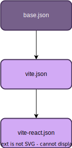

# Config Typescript

Shared configuration to use with [Typescript](https://www.typescriptlang.org/).

## Typescript configurations

There are 3 available typescript configuration files:

- `base.json`: For a basic typescript project.
- `vite.json`: For a typescript project build with vite.
- `vite-react.json`: For a react typescript project build with vite.

All configurations inherit from `base.json` file, and `vite.json` is also the reference for `vite-react.json` as the diagram below shows:

<p align="center">
  
</p>

## Installation

Add typescript config to your app/package as a dependency by running the command:

```sh
npm install @torian12321/typescript-config --save-dev
```

## Usage

At your app/package root level, add a `tsconfig.json` file and add

```json
{
  "extends": "@torian12321/typescript-config/base.json",
  "include": ["src"]
}
```

If you have a Vite app, copy instead:

```json
{
  "extends": "@torian12321/typescript-config/vite.json",
  "include": ["src"]
}
```

And if it is a Vite+React.js app copy:

```json
{
  "extends": "@torian12321/typescript-config/vite-react.json",
  "include": ["src"]
}
```

From here, override the props to what is necessary for your application.
It is recommended to keep the configuration as it is set by default if possible, and exclusively override the `"include"` and `"exclude"` sections.
